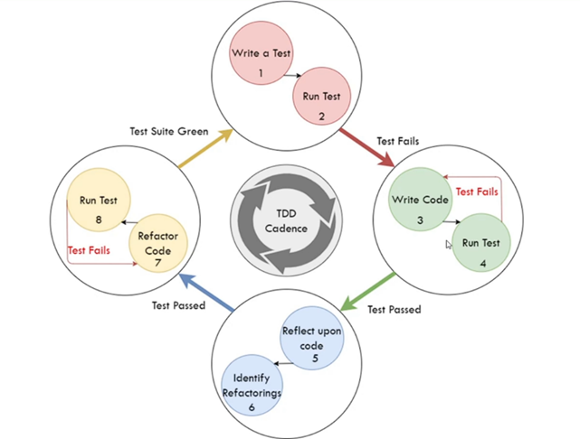

**Le cycle TDD : Le cycle rouge-vert-refactorisation**

Ensuite, nous avons le cycle **red-green-refactor** ou le cycle de **red-green-reflect-refactor**, qui en est une version élargie. Dans ce cycle, 
ce que nous faisons, c'est que nous passons par les étapes du rouge au vert et à la refactorisation dans une sorte de cadence.

Le cycle commence au **rouge**, lorsque vous écrivez un test, que vous l'exécutez et que vous constatez qu'il échoue. Il doit échouer pour la bonne raison, ce dont nous parlerons plus tard. Pendant le cours, nous voulons nous assurer que le test échoue pour une bonne raison.

À ce stade, on peut passer à l'étape **verte**, qui consiste à essayer de faire passer le test, c'est-à-dire à faire en sorte que le résultat du test passe d'un échec, un état rouge, à une réussite, un état vert. Ici, nous écrivons du code, nous exécutons le test. Si tout passe, nous pouvons passer à l'étape suivante. Si l'échec persiste, nous devrons peut-être apporter quelques modifications à notre code, puis exécuter à nouveau les tests jusqu'à ce qu'ils soient réussis.

L'idée est de rester dans le rouge très peu de temps. Nous devons passer au vert dès que possible. Le plus rapidement possible.

Ensuite, une fois que nous sommes passés au vert, nous passons à l'étape de la **réflexion**. Dans l'étape de réflexion, l'objectif est d'essayer de réfléchir au code dans son état actuel et d'identifier les _refactorings_. C'est-à-dire les améliorations qui pourraient être apportées au code.

N'oubliez pas que la refactorisation consiste à modifier la structure du code sans changer le comportement observé. L'idée ici est donc de chercher des choses que nous pouvons faire pour améliorer le code et qui ne vont pas casser les tests. Nous savons que nous ne changeons pas le comportement externe parce que nous ne cassons aucun test en faisant des refactorings. Il s'agit donc vraiment de la structure et de la qualité du code. Peut-être que certains noms doivent être améliorés. Peut-être que certaines méthodes ou fonctions doivent être extraites.

Quoi qu'il en soit, l'idée est ici d'identifier les _refactorings_, puis de passer à l'étape où l'on procède aux refactorings. Pendant que nous procédons aux refactorings, nous exécutons les tests. Si un test échoue, nous devrions le refactorer et réessayer. Si le test est toujours réussi, c'est que notre refactorisation a été couronnée de succès. À un moment donné, nous pouvons décider de passer à l'étape suivante et passer au test suivant.

Je vous encourage à ne pas ignorer complètement la phase de refactorisation. C'est pourquoi j'ai ajouté une phase de réflexion, car vous devez constamment réfléchir à la qualité et au résultat de ce que vous produisez : **_votre code_**. Cette méthode de **TDD** a tendance à avoir plus de retour d'informations venant du code que les méthodes où nous pensons au codage pendant longtemps et commençons ensuite à écrire.

Dans le cadre du **TDD**, on écrit un petit test, on le fait passer, on y réfléchit, on regarde le code, on écrit un petit test, on en fait passer un, on y réfléchit, on regarde le code. Le retour d'information est beaucoup plus important, car il faut se demander comment se présente le code et ce qu'il faut améliorer. Que dois-je améliorer ? Où puis-je l'améliorer ? En cours de route.

Vous n'avez pas besoin de choisir entre ce cycle de red-green-refactor et les trois lois. Ils se complètent mutuellement. Parce que tout en 
avançant dans ce cycle, nous utilisons également les trois lois pour nous guider à chaque étape. Ainsi, nous pouvons les utiliser pour nous aider à décider quand passer du rouge au vert, c'est-à-dire quand est-ce que le changement est suffisant selon les trois lois. Les trois lois nous disent que même un échec de compilation est un échec, et que l'on peut donc passer au code de production. Elles nous disent également combien de choses il faut faire en vert avant de passer à autre chose. Cela implique que vous pouvez écrire beaucoup de code, mais les trois lois nous disent qu'il faut juste assez de code pour que le test passe.

Ainsi, ne vous arrêtez pas à ce stade. Les trois lois et le cycle de red-green-refactor travaillent ensemble pour vous guider tout au long du processus **TDD**.